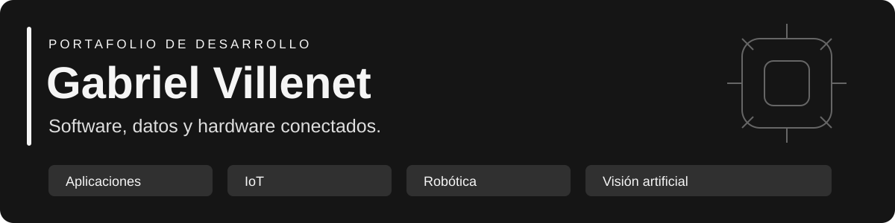

# Hola, soy Gabriel Villenet

Desarrollo aplicaciones y sistemas que conectan **software, datos y hardware**. Trabajo en proyectos de IoT, robótica y visión artificial, y preparo herramientas educativas para aprender construyendo.

Este portafolio reúne una selección de mi trabajo. Cada proyecto documenta su alcance, cómo ejecutarlo y qué falta validar.

## Proyectos destacados

### 01 · EcoSphere
**Microclima inteligente · IoT y aplicaciones multiplataforma**

Supervisión de sensores y control de riego, ventilación e iluminación mediante un ESP32. El repositorio reúne clientes para Android, escritorio y web, con telemetría, historial y autenticación.

**Tecnologías:** Kotlin · Compose · JavaScript · ESP32 · Supabase  
**Estado:** en desarrollo; la operación completa requiere configurar el backend y conectar el hardware.

[Explorar proyecto](https://github.com/VillenetMK/EcoSphere) · [Arquitectura](https://github.com/VillenetMK/EcoSphere/blob/main/docs/PLATFORM_UI_ARCHITECTURE.md)

### 02 · MuniGest Chiclayo
**Gestión de expedientes · Aplicación en Python**

Piloto para registrar solicitudes, derivarlas entre áreas y consultar su historial. Incluye roles, adjuntos, reportes y una demostración local con datos ficticios.

**Tecnologías:** Python · Flet · Supabase · PostgreSQL  
**Estado:** piloto 0.1; validación municipal, despliegue y empaquetado pendientes. No representa un sistema municipal oficialmente implementado.

[Explorar proyecto y demo local](https://github.com/VillenetMK/sistema-municipal) · [Alcance](https://github.com/VillenetMK/sistema-municipal/blob/main/docs/ALCANCE.md)

### 03 · Movilidad robótica
**ROS 2 y Jetson · Odometría y sensores**

Desarrollo de una base para integrar LiDAR e IMU y estimar el movimiento del robot desde pulsos medidos de sus ruedas. Incluye publicación de odometría, transformaciones y diagnóstico.

**Tecnologías:** Python · ROS 2 Humble · NVIDIA Jetson · LiDAR · IMU  
**Estado:** odometría implementada; validación en Jetson, conexión física y calibración pendientes. La navegación autónoma es una fase posterior.

[Explorar proyecto](https://github.com/VillenetMK/robot-mobility-ros2-jetson) · [Guía de odometría](https://github.com/VillenetMK/robot-mobility-ros2-jetson/blob/main/docs/ODOMETRIA.md)

### 04 · Reconocimiento por webcam
**Visión artificial · Herramienta educativa**

Detección local de objetos y rostros con etiquetas en español. La interfaz utiliza alto contraste y formas diferentes para distinguir resultados.

**Tecnologías:** Python · OpenCV · Ultralytics YOLO11n  
**Alcance:** categorías COCO y detección frontal de rostros; no identifica personas por nombre ni guarda fotos o videos.

[Explorar proyecto y ejecutarlo](https://github.com/VillenetMK/reconocimiento_webcam)

## Tecnologías en estos proyectos

| Área | Herramientas |
|---|---|
| Aplicaciones | Python, Kotlin, JavaScript, Flet y Compose |
| Datos y servicios | PostgreSQL, Supabase e integración de APIs |
| IoT y robótica | ESP32, C++/Arduino, ROS 2, Jetson y comunicación serial |
| Visión artificial | OpenCV y YOLO |
| Desarrollo | Git, GitHub Actions, pruebas automatizadas y documentación |

## Más trabajo en robótica

[MAXCIM · Control de brazos v8](https://github.com/VillenetMK/BRAZOS_MAXICM_v8): panel web, secuencias de movimiento y comunicación entre ROS 2, ESP32 y PCA9685. Su README enlaza las otras revisiones para facilitar la comparación.

---

**Para conocer un proyecto:** empieza por su README, revisa el alcance y sigue la guía de ejecución. Los repositorios distinguen las funciones implementadas de las integraciones y pruebas pendientes.
